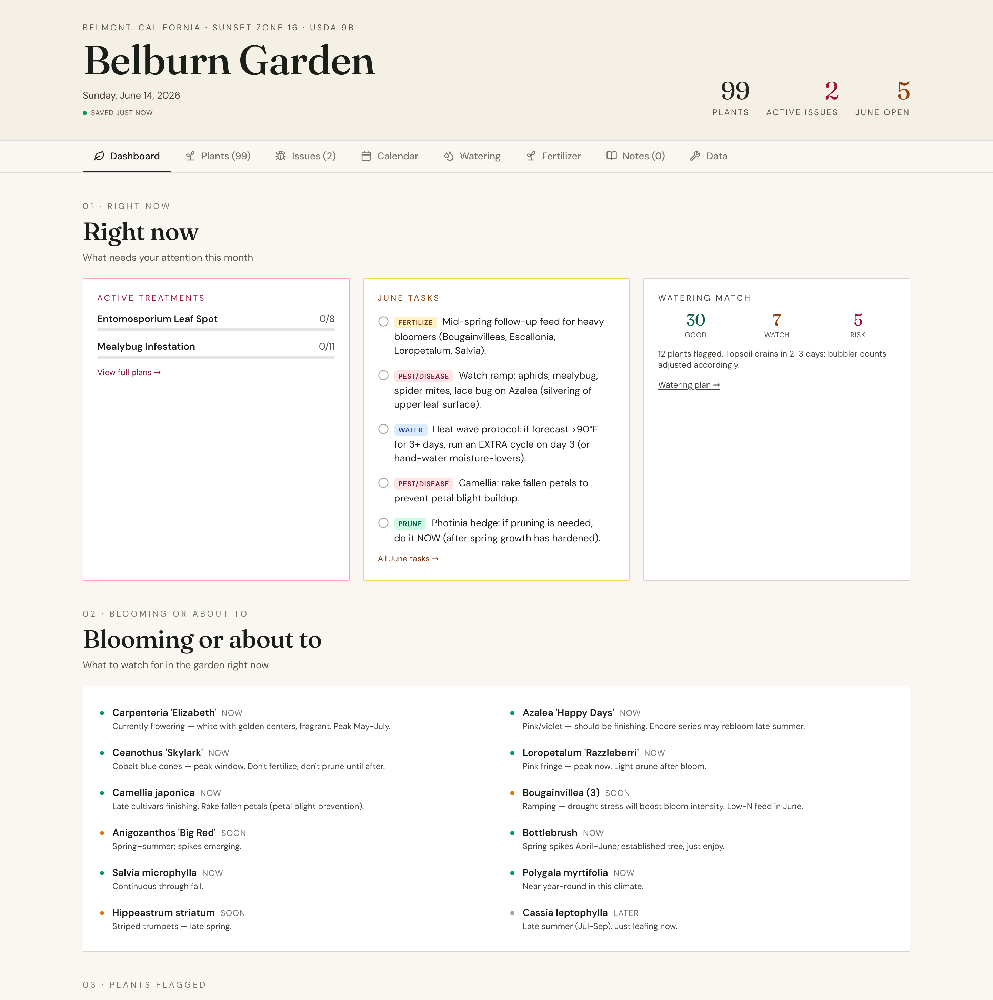
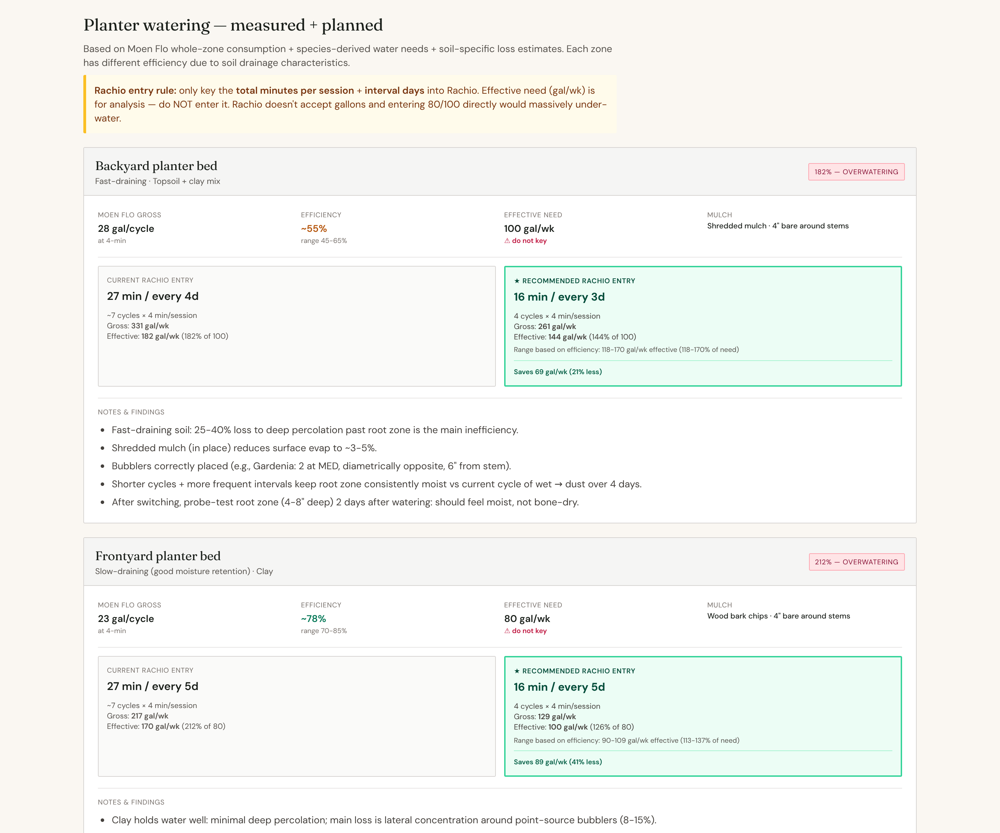
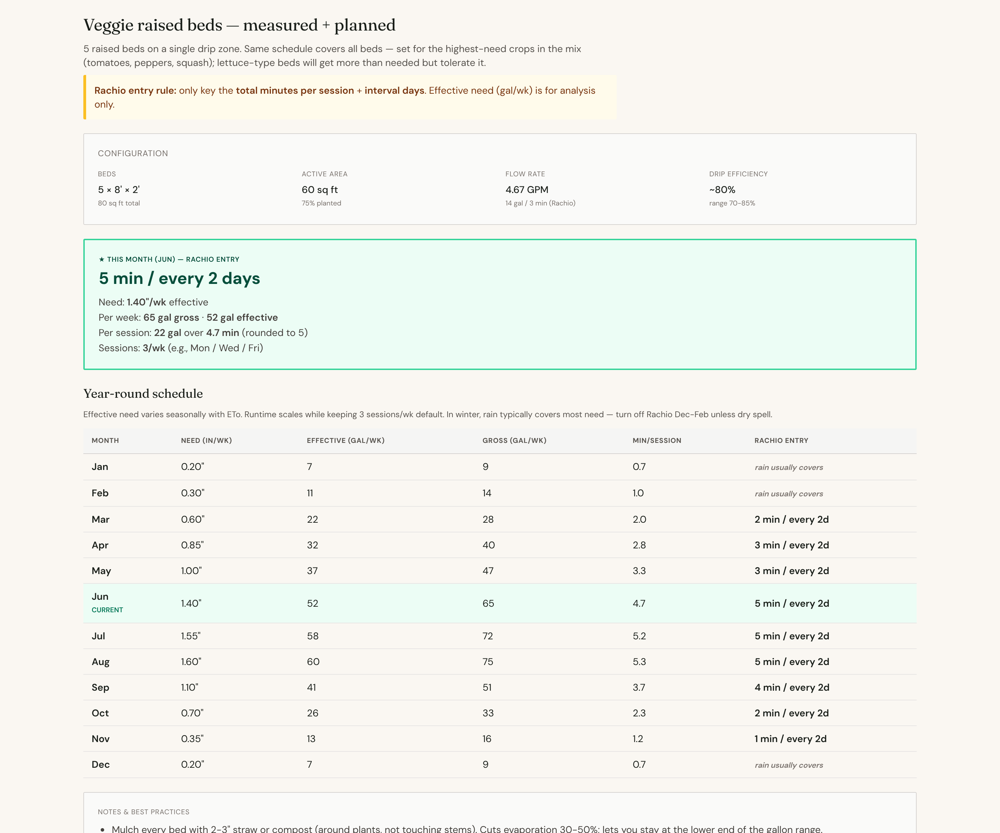
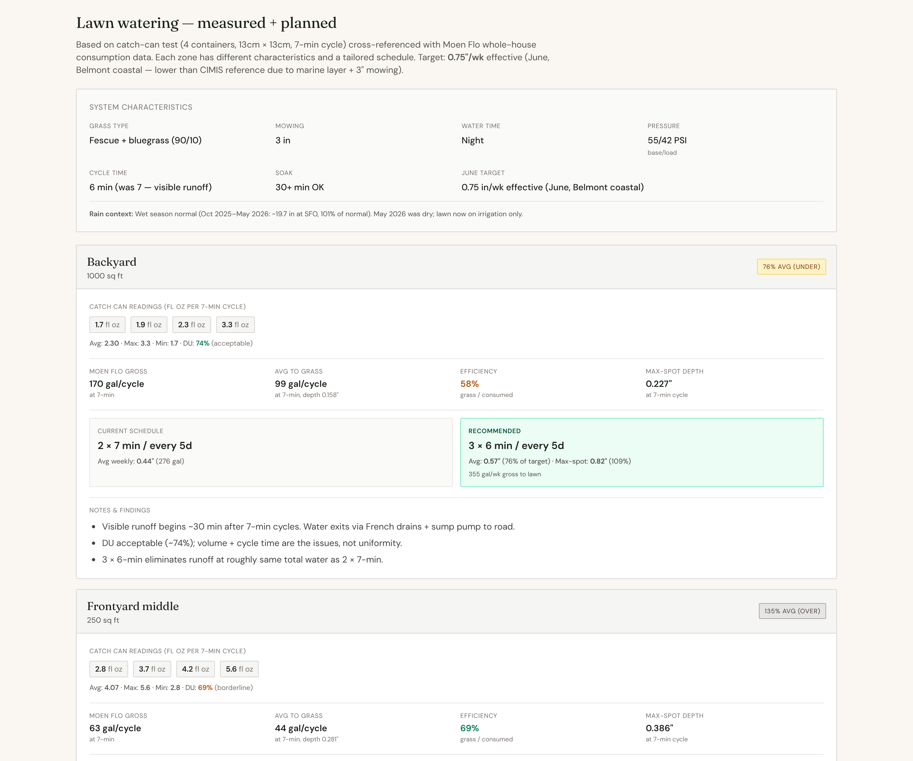
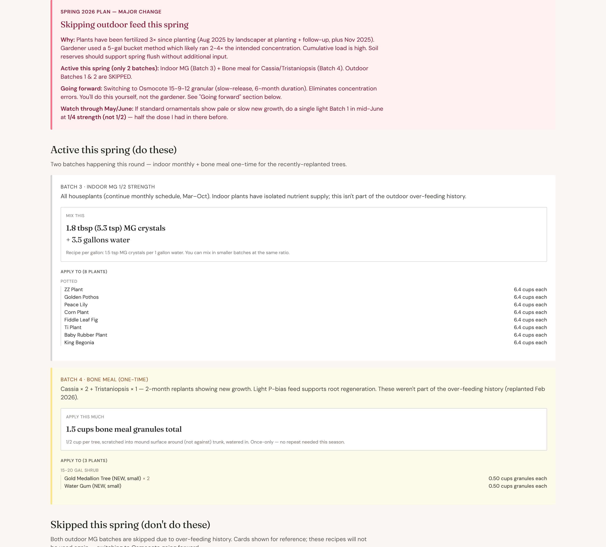

# Landscape Optimization System

A single-file React app I built with Claude (Anthropic) to run my actual home garden. **125+ plants and trees including a vegetable bed, 1,500 sq ft of lawn, 8 irrigation zones**, three different soil types, four different watering systems. Replaces generic gardening advice with measurement-driven schedules, proactive disease identification, and treatment protocols grounded in real data.

**Stack:** React 18 (single file, ~3,900 lines), Tailwind CSS, `window.storage` for persistence, no build step, no dependencies. Mobile-responsive. Lives inside [Claude Artifacts](https://claude.ai) so it stays editable as the garden evolves — but the same code runs anywhere React runs.

**Live demo:** https://claude.ai/public/artifacts/7c30f400-b543-4df6-b6a7-52d8323c1cf0

**Built with:** Claude Opus (Anthropic). Vibe-coded over months while solving real garden problems in parallel.

---

## Why this exists

Most home landscape advice runs on inherited shortcuts: "water 15 minutes on these days," "fertilize twice a year," "more water if it's yellow." Generic shortcuts fail because real landscapes are systems with:

- **Soil type variation** across yards (clay vs amended topsoil drain 5-10× differently)
- **Seasonal evapotranspiration** (June water demand is ~4× January's, varies 5%+ month-to-month)
- **Per-species requirements** (Bougainvilleas want 1/4 the nitrogen of Camellias; Cassia tolerates drought, Plum doesn't)
- **Distribution uniformity problems** (catch can test of my backyard lawn showed driest spot getting 1/4 the water of the wettest)
- **Delivery system inefficiencies** (zone efficiency ranges 22-78% in my yard — knowable only by cross-referencing whole-house flow data with catch-can measurements)

Local gardeners working from passed-down folk knowledge can't operate at this resolution. They apply approximate inputs to a system that responds to precise ones. The plants don't die — they just underperform, slowly, in ways nobody attributes to the schedule.

---

## The triangulation

The value isn't in any single input. It's in **triangulating four sources** that each tell you something the others can't:

| Source | What it tells you | What it can't tell you |
|---|---|---|
| **Science** (soil type, plant species, climate, ETo) | What plants need in theory | Whether they're actually getting it |
| **Health measurement** (probe tests, leaf-spot identification, wilt observation, photo diagnosis) | What plants are actually experiencing | Why |
| **Irrigation intelligence** (flow meter, catch can, distribution uniformity, efficiency calc) | Where water is actually going | Whether that matches what plants need |
| **Practical wisdom** (cycle-and-soak for clay, mulch placement, off-season scheduling) | What works in the field | When it doesn't apply to your specific case |

Each source on its own gives a partial answer. Together they give a complete one. The app encodes all four and surfaces the cross-references — telling you, for example, that your "150 gal/week" consumption is actually delivering 55 gal/week to root zones in fast-draining soil, while the species need is 100 gal/week, so you're over-pumping AND under-delivering simultaneously.

That kind of insight is invisible from any single source.

---

## What it does

| Tab | What it owns |
|---|---|
| **Dashboard** | Status at a glance, top priorities, recent activity |
| **Plants** | Per-plant cards for all 125+ specimens: species, scientific name, location, container size, sun exposure, flow assignment, bubbler count, quantity. Full CRUD. |
| **Issues** | **Proactive disease and pest identification.** Plant-specific problem tracking with diagnostic protocols, treatment plans, and explicit decision dates. Mealybug control, drought stress, fungal disease, transplant shock — all surface here with next-action recommendations. |
| **Calendar** | Monthly action lists tied to seasonal ETo. What to do in April vs August vs November. |
| **Watering** | Per-zone schedules, per-plant audit (delivered vs needed), three measurement-driven subsystem cards (planters / lawn / veggies), efficiency analysis, heat-wave protocols, monitoring checklist. |
| **Fertilizer** | Multi-batch recipes with per-plant ingredient calculations. Soil pH testing logger with zone-specific history. Skip-list logic for newly-planted, drought-tolerant, recently-fed plants. |
| **Notes** | Free-form per-plant observations. Photo upload. Timeline view. |
| **Data** | Export/import JSON for backup/restore. |

### What I do, what the app does

The app handles diagnostics, scheduling, math, and treatment planning. **I spend ~15 minutes every 2 weeks on a short checklist of things AI can't do:**

- Walk the yard and visually inspect bubblers for blockages, breaks, or kinks
- Look at plants for "anything weird" — new leaf color, growth patterns, soft stems, insect activity
- Photograph anomalies and hand them to the app for diagnosis
- Probe-test soil moisture at root depth in 2-3 spots per zone
- Refill Treegator bags on newly-planted trees during establishment season

Everything else — what to water, when, how much, which fertilizer to mix, when to skip a feeding, how to respond to a mealybug outbreak — is in the app.

---

## Screenshots

### Dashboard


### Watering — planter analysis
Measurement-driven efficiency analysis across soil types. Current vs recommended Rachio schedule, with effective need shown but marked "do not key."


### Watering — veggie beds
Year-round schedule generated from monthly ETo; current month highlighted with the exact Rachio entry.


### Watering — lawn (catch can analysis)
Distribution Uniformity, flow meter efficiency, current vs recommended schedule per zone.


### Fertilizer — recipe with skip-list logic
Multi-batch recipes with per-plant ingredient calculations, plant-specific skip reasons.


---

## Logic and build complexity

This isn't a CRUD app over a plant list. The non-trivial math:

### Seasonal water need (CIMIS ETo)

Per-plant water needs scale with monthly evapotranspiration from CIMIS Zone 3 (Belmont coastal). Twelve months of multipliers, applied to species-specific gallons/week baselines, displayed in real time with manual season override:

```javascript
need_per_week = base_gpw * ETO_FACTOR_BY_MONTH[currentMonth]
```

ETo multipliers range from 0.21 (December) to 1.00 (June). A plant calibrated for "needs 5 gal/week peak summer" automatically becomes "needs 1.05 gal/week in December."

### Distribution Uniformity from catch cans

Catch can readings (4 containers, 13cm × 13cm openings, 7-min cycle) get converted from fluid ounces to inches of depth:

```javascript
container_area_sqin = 169 cm² ÷ (2.54)² = 26.19 in²
depth_inches = (fl_oz × 1.8047 in³/fl_oz) ÷ 26.19
gallons_to_zone = depth_inches × zone_sqft × 0.623
```

Distribution Uniformity (Low Quarter method) is computed per zone:

```javascript
DU = (avg_lowest_25_percent / overall_avg) × 100
```

Color-coded thresholds (≥70% acceptable, 60-69% borderline, <60% poor) drive recommendations.

### Sprinkler efficiency from whole-house flow data

A whole-house flow meter measures gallons consumed per cycle at the valve. Cross-referencing with catch can delivery gives true efficiency:

```javascript
efficiency = (avg_catch_can_gallons / gross_gallons_consumed) × 100
```

My zones came back at 58%, 70%, and 22% — the last is structurally poor due to layout constraints (verge curbing rebound + slope distribution mean the lawn survives anyway). That insight is invisible without measurement.

### Per-species fertilizer recipes

Multi-batch fertilizer planning with skip-list logic. Each batch has:

- Mix ratio (e.g., 1.5 tsp MG/gallon at 1/2 strength; 1/2 cup bone meal per tree)
- Target group (standard, acid-loving, bougainvilleas, indoor)
- Per-plant volume calculation by container size
- Skip filters (drought natives, newly planted <4 weeks, recently fed)

Output is a literal recipe: "Batch 1: Apply 4 cups solution to each of [list], skip [list with reasons]."

### Root zone delivery vs gross application

A frequently missed insight: lawn sprinklers might deliver 0.55″ to the surface but only **15-25% reaches tree root depth (12+″)** in clay soil with active grass competition. Soil layer modeling determines what actually reaches plant roots versus what's just wetting the top 6″ for lawn grass:

```javascript
effective_to_trees = gross × (1 - grass_competition_factor) × clay_infiltration_efficiency
```

This is why my Krauter Vesuvius plums were dying despite the lawn looking "well watered."

### Per-zone watering analysis (3 subsystems, 8 irrigation zones)

The Watering tab includes three measurement-driven subsystems, each with their own efficiency profile and recommendations:

| Subsystem | Method | Efficiency | Key insight |
|---|---|---|---|
| **Ornamental planter bubblers (2 zones)** | Flow meter + soil probe | 55-78% | Fast-draining backyard topsoil loses 25-40% to deep percolation; clay frontyard loses <10% |
| **Lawn sprinklers (3 zones)** | Flow meter + catch can | 22-70% | 22% zone has lawn growing fine anyway due to indirect water from curbing rebound and slope distribution |
| **Veggie raised bed drip (1 zone)** | Rachio flow rate | ~80% | Monthly seasonal table generated; shared drip line covers 5 beds with single schedule |

Each subsystem shows current vs recommended Rachio entry (in minutes + interval days) and projected weekly savings. Total projected savings across subsystems: **~250 gal/week**, or 13,000 gal/year if applied year-round.

### Persistent state model

```
window.storage keys:
  plants:           array of plant objects (species, location, flow, bub, qty, etc.)
  schedules:        per-zone runtime + interval
  fertilizer_log:   timestamped fertilization events
  ph_readings:      timestamped soil pH/NPK samples per zone
  issues:           active problem tracking with decision dates
  notes:            free-form observations + photos
```

JSON export/import via single button — backup, restore, and migration between Claude artifact versions.

### Mobile-responsive throughout

Every table, schedule control, and audit section has parallel desktop and mobile renderings. The intended use case is checking the schedule on a phone while standing in the yard, not at a desk.

---

## Built with AI

This was built by directing Claude across dozens of sessions, often while standing in the actual garden inspecting the actual plants. I'm not an engineer — my role was systems thinking, problem decomposition, and adversarial review of Claude's output.

What "vibe coding" actually looks like for a project this size:

- **First 10 messages**: not production — clarifying the deliverable shape, scoping the data model, picking the right environment (Claude Artifacts over alternatives because I wanted persistent in-conversation iteration, not a one-shot deploy)
- **Iterative complexity**: started as a plant list. Each real garden problem added a subsystem. Mealybug crisis → Issues tab. Catch can test → DU math. Whole-house flow data → efficiency analysis.
- **Adversarial review**: catching when Claude's logic didn't fit reality. Examples I had to push back on:
  - Applying mature-tree "dripline watering" advice to a 2-month-old newly planted tree (root ball is at the trunk, not the dripline)
  - Recommending a product (imidacloprid) banned outdoors in California under AB 363
  - Assuming product warranties that didn't exist
  - Pattern-matching Photinia symptoms as Entomosporium when the actual cluster was sun-bleaching
- **Verification protocols**: every "this fixes X" required Claude to verify, not just claim. Parser checks via `node --check` on extracted script content. Explicit count of opening/closing tags. Grep for symptom keywords. Real artifact rendering before sharing.

This is the work product of someone who can use AI as a thinking and execution surface for substantial software — not the work product of an engineer. The point of sharing is to demonstrate the former.

---

## Tech stack and complexity

| Metric | Value |
|---|---|
| **Language / framework** | React 18 (JSX) |
| **Styling** | Tailwind CSS |
| **Persistence** | `window.storage` (artifact-native), JSON export/import |
| **Dependencies** | None (single file, no build step) |
| **Total lines** | ~3,900 |
| **Top-level functions** | 40+ |
| **React components** | 30+ |
| **Constants** | 50+ (plant size catalogs, ETo factors, fertilizer dosing tables, season presets, etc.) |
| **Tabs / major sections** | 8 |
| **Subsystem audit cards** | 3 (planters / lawn / veggies) with independent measurement + recommendation logic |
| **Irrigation zones modeled** | 8 |
| **Plants managed** | 125+ |
| **Mobile rendering** | Every interactive component has phone + desktop variants |

---

## How to use it

### View my live version

https://claude.ai/public/artifacts/7c30f400-b543-4df6-b6a7-52d8323c1cf0

This runs my actual garden data — Belmont CA, real measurements, real schedules. View-only unless you fork.

### Fork it for your own landscape

1. Clone this repo
2. Open `app.jsx` in any React-compatible environment (Claude Artifacts, CodeSandbox, Vite, etc.)
3. Replace the seed plant data with your own (search for `PLANTS_SEED`)
4. Replace measurement data (catch cans, flow rates, pH readings) with your own observations
5. Update CIMIS ETo factors if you're not in a similar climate to Belmont coastal (Zone 3) — CIMIS provides per-zone tables for California

For the most natural editing experience, paste it into Claude as an artifact and describe changes in plain English. That's how it was built.

### Limitations

- **Not a SaaS product.** Single-file artifact. No login, no multi-user, no API. Personal use.
- **Not engineer-grade.** No tests, no error boundaries, no TypeScript. Built to solve a problem, not as production infrastructure.
- **Climate-specific calibration.** Belmont CA, USDA 9b, CIMIS Zone 3 coastal. Other climates need recalibration.
- **No external integrations.** Doesn't talk to Rachio API, weather services, or flow meter APIs. Manual data entry. (Could be added — wasn't worth the time for personal use.)

---

## License

MIT. Take it, fork it, run with it.

---

## Acknowledgments

Built with **Claude Opus** (Anthropic). The model that makes it possible to ship real software by treating natural language as a programming interface.
